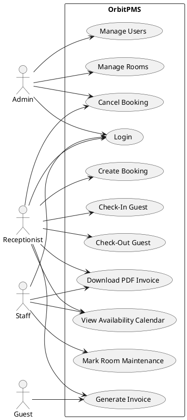
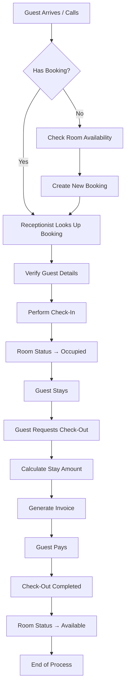
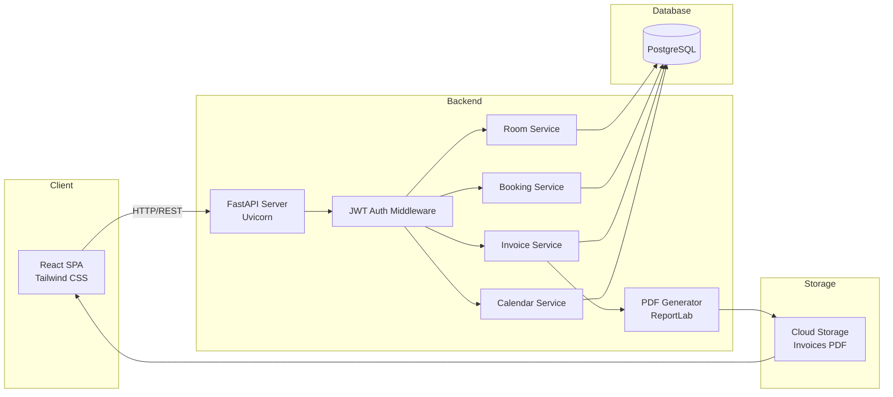
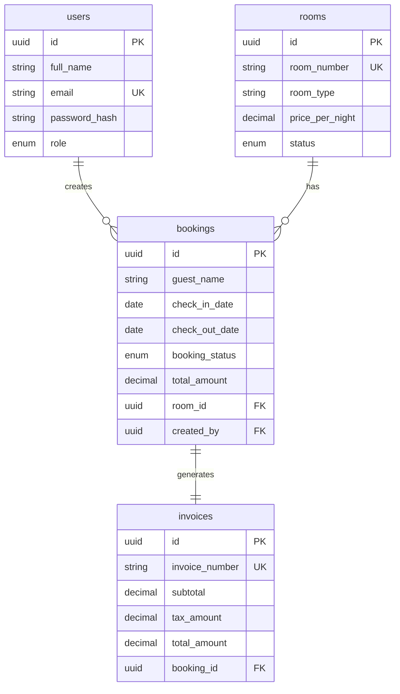
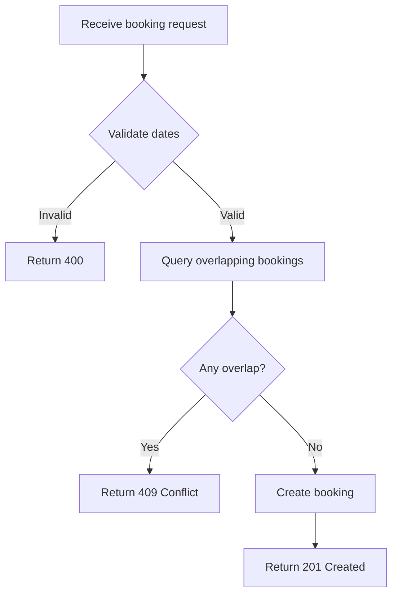
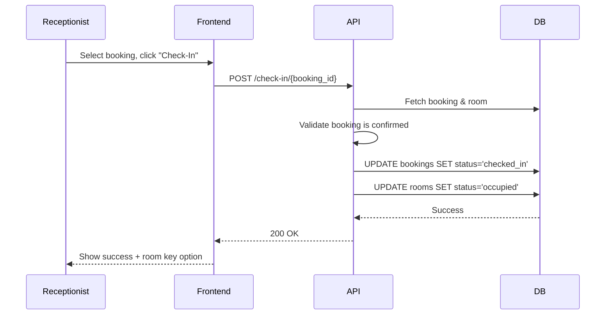
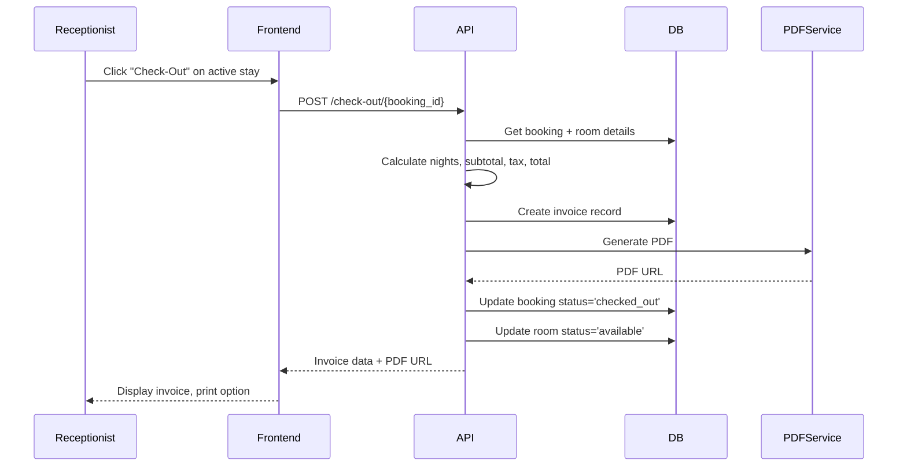
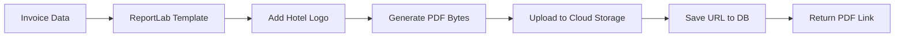
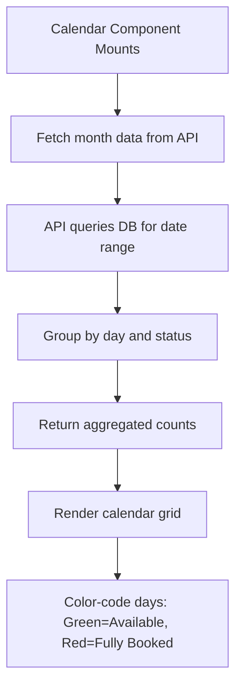
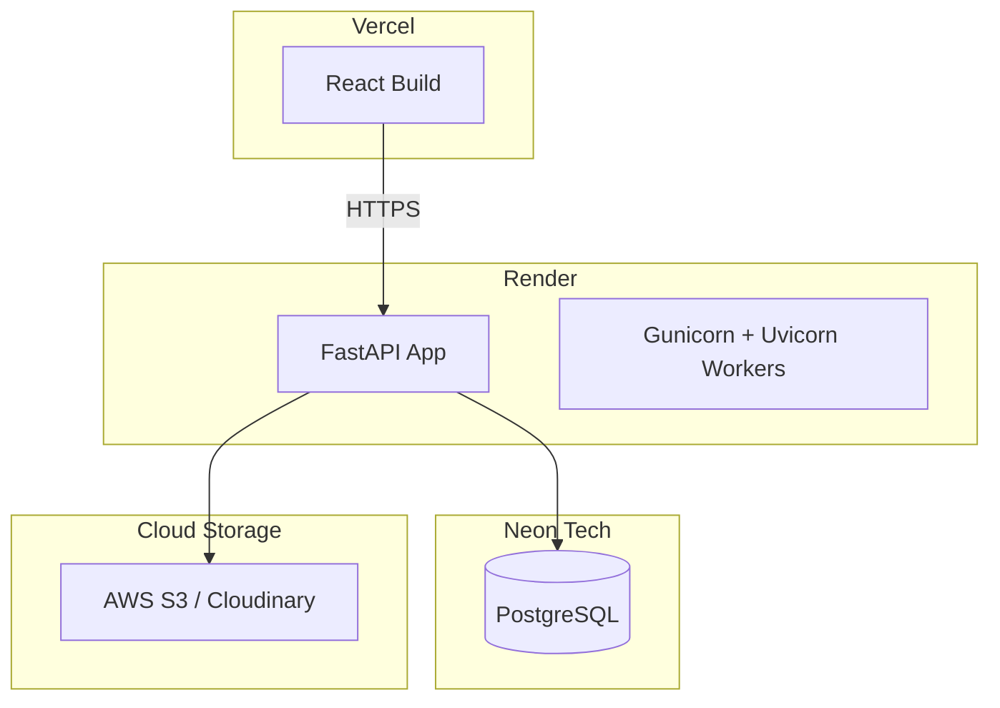

Here is the complete software documentation package for **OrbitPMS**, structured as an enterprise-grade deliverable.

---

# ORBITPMS – HOTEL PROPERTY MANAGEMENT SYSTEM

## COMPLETE SOFTWARE DOCUMENTATION

**Document Version:** 1.0  
**Prepared By:** Senior Solution Architecture Team  
**Date:** June 09, 2026  
**Status:** Approved for Development

---

## 1. Executive Summary

### Project Overview
OrbitPMS is a modern, web-based Property Management System designed to streamline hotel front-desk operations, room inventory control, and guest billing. Built with React, FastAPI, and PostgreSQL, it provides a responsive, secure, and scalable platform.

### Business Goal
To reduce manual booking errors by 95%, improve room turnover efficiency by 40%, and provide real-time availability visibility, ultimately increasing revenue per available room (RevPAR).

### System Objectives
- Digitize the guest journey from booking to checkout.
- Prevent double bookings with real-time conflict detection.
- Automate invoice generation and PDF creation.
- Provide role-based access for Admin, Receptionist, and Staff.

### Key Benefits
- **Zero double bookings** via database-level validation.
- **Instant availability calendar** for front-desk staff.
- **Secure JWT authentication** with role-based permissions.
- **Complete audit trail** of all transactions.
- **Mobile-responsive interface** using Tailwind CSS.

---

## 2. Software Requirement Specification (SRS)

### Functional Requirements

| Module | Requirement ID | Description |
|--------|----------------|-------------|
| Authentication | F-AUTH-01 | User registration with email/password |
| | F-AUTH-02 | Login with JWT token issuance |
| | F-AUTH-03 | Role-based access (Admin, Receptionist, Staff) |
| Room Management | F-RM-01 | CRUD operations for rooms |
| | F-RM-02 | Room types: Single, Double, Suite, Deluxe |
| | F-RM-03 | Room status: Available, Occupied, Maintenance |
| Booking Management | F-BK-01 | Create booking with guest details |
| | F-BK-02 | Prevent overlapping bookings for same room |
| | F-BK-03 | Cancel booking and release room |
| Check-In | F-CI-01 | Convert booking to active stay |
| | F-CI-02 | Update room status to Occupied |
| Check-Out | F-CO-01 | Calculate total stay amount |
| | F-CO-02 | Generate final invoice |
| | F-CO-03 | Release room back to Available |
| Invoice | F-INV-01 | View invoice with stay details |
| | F-INV-02 | Download PDF invoice |
| Availability Calendar | F-CAL-01 | Monthly calendar view of room occupancy |
| | F-CAL-02 | Filter by room type |

### Non-Functional Requirements

| Category | Requirement |
|----------|-------------|
| Performance | API response time < 300ms for 100 concurrent users |
| Scalability | Horizontal scaling via stateless FastAPI |
| Security | Bcrypt password hashing, JWT with 1-hour expiry |
| Availability | 99.9% uptime (database replication optional) |
| Usability | WCAG 2.1 AA compliant, mobile-first design |
| Responsiveness | Tailwind CSS breakpoints (sm, md, lg, xl) |

---

## 3. User Roles and Permissions Matrix

| Feature | Admin | Receptionist | Staff |
|---------|-------|---------------|-------|
| **Room Management** | | | |
| Create/Edit/Delete Room | ✅ | ❌ | ❌ |
| View Rooms | ✅ | ✅ | ✅ |
| Update Room Status | ✅ | ✅ | ✅ (Maintenance only) |
| **Booking Management** | | | |
| Create/Edit/Cancel Booking | ✅ | ✅ | ❌ |
| View All Bookings | ✅ | ✅ | ❌ |
| **Check-In / Check-Out** | | | |
| Perform Check-In | ✅ | ✅ | ❌ |
| Perform Check-Out | ✅ | ✅ | ❌ |
| **Invoices** | | | |
| View All Invoices | ✅ | ✅ | ❌ |
| Download PDF | ✅ | ✅ | ✅ (own shift) |
| **Availability Calendar** | ✅ | ✅ | ✅ (view only) |
| **User Management** | ✅ | ❌ | ❌ |
| **Reports** | ✅ | ✅ (limited) | ❌ |

---

## 4. User Stories (20+)

1. **As a Receptionist**, I want to view today's expected check-ins, so that I can prepare welcome packets.
2. **As a Receptionist**, I want to create a booking, so that I can reserve a room for a guest.
3. **As a Receptionist**, I want to see a calendar of room availability, so that I can offer alternatives when a room is booked.
4. **As a Receptionist**, I want to check in a guest, so that the room status changes to Occupied.
5. **As a Receptionist**, I want to check out a guest, so that the room becomes Available again.
6. **As a Receptionist**, I want to generate an invoice at checkout, so that the guest pays the correct amount.
7. **As an Admin**, I want to add a new room type (e.g., Presidential Suite), so that I can expand hotel inventory.
8. **As an Admin**, I want to mark a room as Under Maintenance, so that receptionists cannot book it.
9. **As an Admin**, I want to view all active bookings, so that I can monitor occupancy.
10. **As an Admin**, I want to create new staff accounts with specific roles, so that access is controlled.
11. **As a Staff member**, I want to mark a room as dirty/clean, so that housekeeping status is tracked (future).
12. **As a Guest** (via receptionist), I want to receive a printed or emailed invoice, so that I have a record of my stay.
13. **As a Receptionist**, I want to cancel a booking without penalty within 24 hours, so that I can be flexible with cancellations.
14. **As a Receptionist**, I want to modify a booking's check-out date, so that I can accommodate guest extensions.
15. **As an Admin**, I want to apply a discount to an invoice, so that loyal guests receive benefits.
16. **As a Receptionist**, I want to search bookings by guest name or booking ID, so that I can quickly find reservations.
17. **As a Staff member**, I want to view today's checkout list, so that I can prepare for departures.
18. **As an Admin**, I want to generate a monthly revenue report, so that I can analyze financial performance.
19. **As a Receptionist**, I want to see warnings when trying to double-book a room, so that I avoid mistakes.
20. **As a Guest**, I want to see my booking confirmation number, so that I can reference it at check-in.
21. **As an Admin**, I want to archive old bookings older than 1 year, so that the database stays performant.
22. **As a Receptionist**, I want to add walk-in guests without a prior booking, so that I can handle direct arrivals.

---

## 5. Use Case Diagram (PlantUML)



---

## 6. Business Workflow Diagram (Mermaid)



---

## 7. System Architecture Diagram (Mermaid)



---

## 8. Database Design (Complete ERD)

### Entities and Tables

#### **users**
| Column | Type | PK/FK | Constraints |
|--------|------|-------|-------------|
| id | UUID | PK | DEFAULT gen_random_uuid() |
| full_name | VARCHAR(100) | NOT NULL |
| email | VARCHAR(255) | UNIQUE, NOT NULL |
| password_hash | VARCHAR(255) | NOT NULL |
| role | ENUM | ('admin','receptionist','staff') |
| is_active | BOOLEAN | DEFAULT true |
| created_at | TIMESTAMPTZ | DEFAULT NOW() |

#### **rooms**
| Column | Type | PK/FK | Constraints |
|--------|------|-------|-------------|
| id | UUID | PK | |
| room_number | VARCHAR(10) | UNIQUE, NOT NULL |
| room_type | VARCHAR(50) | NOT NULL |
| price_per_night | DECIMAL(10,2) | > 0 |
| status | ENUM | ('available','occupied','maintenance') |
| description | TEXT | |

#### **bookings**
| Column | Type | PK/FK | Constraints |
|--------|------|-------|-------------|
| id | UUID | PK | |
| guest_name | VARCHAR(100) | NOT NULL |
| guest_email | VARCHAR(255) | |
| guest_phone | VARCHAR(20) | |
| room_id | UUID | FK(rooms.id) | ON DELETE RESTRICT |
| check_in_date | DATE | NOT NULL |
| check_out_date | DATE | NOT NULL |
| booking_status | ENUM | ('confirmed','checked_in','checked_out','cancelled') |
| total_amount | DECIMAL(10,2) | |
| created_by | UUID | FK(users.id) |
| created_at | TIMESTAMPTZ | DEFAULT NOW() |

#### **invoices**
| Column | Type | PK/FK | Constraints |
|--------|------|-------|-------------|
| id | UUID | PK | |
| booking_id | UUID | FK(bookings.id) | UNIQUE, ON DELETE RESTRICT |
| invoice_number | VARCHAR(20) | UNIQUE, NOT NULL |
| subtotal | DECIMAL(10,2) | |
| tax_amount | DECIMAL(10,2) | |
| total_amount | DECIMAL(10,2) | |
| pdf_url | TEXT | |
| issued_at | TIMESTAMPTZ | DEFAULT NOW() |

### Indexes
- `idx_bookings_dates` ON bookings(check_in_date, check_out_date)
- `idx_rooms_status` ON rooms(status)
- `idx_bookings_room_id` ON bookings(room_id)

---

## 9. ER Diagram (Mermaid)



---

## 10. Database Schema SQL (PostgreSQL)

```sql
-- Enable UUID extension
CREATE EXTENSION IF NOT EXISTS "pguuid-ossp";

-- ENUM types
CREATE TYPE user_role AS ENUM ('admin', 'receptionist', 'staff');
CREATE TYPE room_status AS ENUM ('available', 'occupied', 'maintenance');
CREATE TYPE booking_status AS ENUM ('confirmed', 'checked_in', 'checked_out', 'cancelled');

-- Users table
CREATE TABLE users (
    id UUID PRIMARY KEY DEFAULT gen_random_uuid(),
    full_name VARCHAR(100) NOT NULL,
    email VARCHAR(255) UNIQUE NOT NULL,
    password_hash VARCHAR(255) NOT NULL,
    role user_role NOT NULL DEFAULT 'staff',
    is_active BOOLEAN DEFAULT TRUE,
    created_at TIMESTAMPTZ DEFAULT NOW()
);

-- Rooms table
CREATE TABLE rooms (
    id UUID PRIMARY KEY DEFAULT gen_random_uuid(),
    room_number VARCHAR(10) UNIQUE NOT NULL,
    room_type VARCHAR(50) NOT NULL,
    price_per_night DECIMAL(10,2) CHECK (price_per_night > 0),
    status room_status DEFAULT 'available',
    description TEXT,
    created_at TIMESTAMPTZ DEFAULT NOW()
);

-- Bookings table
CREATE TABLE bookings (
    id UUID PRIMARY KEY DEFAULT gen_random_uuid(),
    guest_name VARCHAR(100) NOT NULL,
    guest_email VARCHAR(255),
    guest_phone VARCHAR(20),
    room_id UUID NOT NULL REFERENCES rooms(id) ON DELETE RESTRICT,
    check_in_date DATE NOT NULL,
    check_out_date DATE NOT NULL,
    booking_status booking_status DEFAULT 'confirmed',
    total_amount DECIMAL(10,2),
    created_by UUID REFERENCES users(id),
    created_at TIMESTAMPTZ DEFAULT NOW(),
    CHECK (check_out_date > check_in_date)
);

-- Invoices table
CREATE TABLE invoices (
    id UUID PRIMARY KEY DEFAULT gen_random_uuid(),
    booking_id UUID UNIQUE NOT NULL REFERENCES bookings(id) ON DELETE RESTRICT,
    invoice_number VARCHAR(20) UNIQUE NOT NULL,
    subtotal DECIMAL(10,2) NOT NULL,
    tax_amount DECIMAL(10,2) NOT NULL,
    total_amount DECIMAL(10,2) NOT NULL,
    pdf_url TEXT,
    issued_at TIMESTAMPTZ DEFAULT NOW()
);

-- Indexes
CREATE INDEX idx_bookings_dates ON bookings(check_in_date, check_out_date);
CREATE INDEX idx_bookings_room_id ON bookings(room_id);
CREATE INDEX idx_rooms_status ON rooms(status);
CREATE INDEX idx_bookings_status ON bookings(booking_status);
CREATE INDEX idx_invoices_booking ON invoices(booking_id);

-- Unique constraint to prevent overlapping bookings (using exclusion constraint)
-- Requires btree_gist extension
CREATE EXTENSION IF NOT EXISTS btree_gist;
ALTER TABLE bookings ADD CONSTRAINT no_overlapping_bookings
EXCLUDE USING gist (room_id WITH =, daterange(check_in_date, check_out_date, '[)') WITH &&);
```

---

## 11. Backend Architecture (FastAPI)

```
backend/
├── app/
│   ├── api/
│   │   ├── v1/
│   │   │   ├── endpoints/
│   │   │   │   ├── auth.py
│   │   │   │   ├── rooms.py
│   │   │   │   ├── bookings.py
│   │   │   │   ├── check_in_out.py
│   │   │   │   ├── invoices.py
│   │   │   │   └── availability.py
│   │   │   └── __init__.py
│   ├── core/
│   │   ├── config.py          # Environment variables
│   │   ├── security.py        # JWT, password hashing
│   │   ├── dependencies.py    # DB session, get_current_user
│   │   └── exceptions.py      # Custom error handlers
│   ├── models/
│   │   ├── user.py
│   │   ├── room.py
│   │   ├── booking.py
│   │   └── invoice.py
│   ├── schemas/
│   │   ├── user.py            # Pydantic models
│   │   ├── room.py
│   │   ├── booking.py
│   │   └── invoice.py
│   ├── services/
│   │   ├── booking_service.py # Conflict detection logic
│   │   ├── invoice_service.py # PDF generation
│   │   └── availability_service.py
│   ├── repositories/
│   │   ├── room_repo.py       # DB queries
│   │   └── booking_repo.py
│   ├── database/
│   │   ├── session.py         # SQLAlchemy setup
│   │   └── base.py
│   └── utils/
│       ├── pdf_generator.py
│       └── validators.py
├── tests/
├── requirements.txt
└── main.py
```

**Folder Responsibility:**
- `api`: Route handlers and request parsing.
- `core`: Configuration, security, and dependency injection.
- `models`: SQLAlchemy ORM models.
- `schemas`: Pydantic request/response validation.
- `services`: Business logic (e.g., double-booking prevention).
- `repositories`: Data access layer (abstracts SQLAlchemy).
- `database`: Connection and session management.

---

## 12. Frontend Architecture (React)

```
frontend/
├── public/
├── src/
│   ├── pages/
│   │   ├── Dashboard/
│   │   ├── Rooms/
│   │   ├── Bookings/
│   │   ├── CheckIn/
│   │   ├── CheckOut/
│   │   ├── Invoices/
│   │   ├── Calendar/
│   │   └── Login/
│   ├── components/
│   │   ├── common/
│   │   │   ├── Navbar.jsx
│   │   │   ├── Sidebar.jsx
│   │   │   └── ProtectedRoute.jsx
│   │   ├── rooms/
│   │   │   ├── RoomCard.jsx
│   │   │   └── RoomForm.jsx
│   │   └── bookings/
│   │       ├── BookingModal.jsx
│   │       └── BookingList.jsx
│   ├── layouts/
│   │   └── MainLayout.jsx
│   ├── services/
│   │   ├── api.js            # Axios instance
│   │   ├── authService.js
│   │   ├── roomService.js
│   │   └── bookingService.js
│   ├── hooks/
│   │   ├── useAuth.js
│   │   └── useBookings.js
│   ├── routes/
│   │   └── AppRoutes.jsx
│   ├── context/
│   │   └── AuthContext.jsx
│   ├── utils/
│   │   ├── dateHelpers.js
│   │   └── formatters.js
│   ├── App.jsx
│   └── main.jsx
├── tailwind.config.js
└── package.json
```

**Folder Responsibility:**
- `pages`: Full-page components (route-level).
- `components`: Reusable UI pieces.
- `layouts`: Shared layout wrappers (sidebar + header).
- `services`: API communication layer.
- `hooks`: Custom React hooks for data fetching.
- `context`: Global auth state.
- `utils`: Helper functions.

---

## 13. API Documentation (REST)

### Authentication APIs

**POST** `/api/v1/auth/login`
```json
// Request
{ "email": "admin@orbitpms.com", "password": "secure123" }

// Response (200 OK)
{ "access_token": "jwt_token_here", "token_type": "bearer", "user": { "id": "...", "role": "admin" } }

// Errors: 401 Unauthorized
```

**POST** `/api/v1/auth/register` (Admin only)
```json
// Request
{ "full_name": "John Doe", "email": "john@example.com", "password": "...", "role": "receptionist" }

// Response (201 Created): { "id": "...", "email": "..." }
```

### Room APIs

**GET** `/api/v1/rooms` → List all rooms  
**POST** `/api/v1/rooms` → Create room  
```json
{ "room_number": "101", "room_type": "Deluxe", "price_per_night": 150.00 }
```
**PUT** `/api/v1/rooms/{id}` → Update room  
**DELETE** `/api/v1/rooms/{id}` → Delete (only if no future bookings)

### Booking APIs

**POST** `/api/v1/bookings`
```json
{
  "guest_name": "Jane Smith",
  "guest_email": "jane@example.com",
  "room_id": "uuid",
  "check_in_date": "2026-07-01",
  "check_out_date": "2026-07-05"
}
// Response: 201 Created with booking object
// Conflict: 409 Conflict { "detail": "Room already booked for these dates" }
```

**GET** `/api/v1/bookings/check-availability?room_id=&start=&end=` → Returns `{ "available": true/false }`

### Check-In / Check-Out

**POST** `/api/v1/check-in/{booking_id}` → Updates booking status to `checked_in`, room status to `occupied`.  
**POST** `/api/v1/check-out/{booking_id}` → Calculates total, generates invoice, releases room.

### Invoice APIs

**GET** `/api/v1/invoices/{id}` → Returns invoice JSON  
**GET** `/api/v1/invoices/{id}/pdf` → Downloads PDF

### Availability Calendar

**GET** `/api/v1/availability/calendar?year=2026&month=7` → Returns daily occupancy counts per room type.

---

## 14. Booking Validation Logic (Double-Booking Prevention)

### Explanation
Overlapping bookings are prevented at **three levels**:
1. **Database exclusion constraint** (PostgreSQL `gist` with `daterange`).
2. **Application service check** (FastAPI service layer).
3. **API validation** (Pydantic model validator).

### Pseudocode
```
function is_room_available(room_id, new_start, new_end):
    overlapping = db.query(Booking)
        .filter(Booking.room_id == room_id)
        .filter(Booking.booking_status != 'cancelled')
        .filter(
            (Booking.check_in_date < new_end) and
            (Booking.check_out_date > new_start)
        )
        .exists()
    return not overlapping
```

### Flowchart (Mermaid)



---

## 15. Check-In Workflow

### Sequence Diagram (Mermaid)



---

## 16. Check-Out Workflow

### Amount Calculation Formula
```
Total Nights = (check_out_date - check_in_date).days
Subtotal = price_per_night × Total Nights
Tax = Subtotal × Tax_Rate (e.g., 12%)
Total = Subtotal + Tax
```

### Mermaid Workflow



---

## 17. Invoice Generation Logic

### Business Rules
- Invoice number format: `INV-YYYYMMDD-XXXX` (sequential).
- Tax rate configurable per hotel (default 12% GST).
- Discounts (optional) applied before tax.
- Zero-rated invoices for corporate accounts.

### PDF Generation Flow



---

## 18. Availability Calendar Logic

### Algorithm
1. Fetch all rooms.
2. For each day in month, count bookings where:
   - `check_in_date <= day <= check_out_date`
3. Categorize by room status.
4. Return JSON: `{ "2026-07-01": { "available": 12, "occupied": 8, "maintenance": 2 } }`

### Mermaid Diagram



---

## 19. Security Design

| Area | Implementation |
|-------|----------------|
| JWT Auth | Access token (1 hour), refresh token (7 days) stored in HTTP-only cookie |
| Password Hashing | Bcrypt with salt rounds=12 |
| RBAC | Dependency `require_role(["admin", "receptionist"])` in FastAPI |
| Input Validation | Pydantic models with `Field(..., min_length=1)` |
| SQL Injection | SQLAlchemy ORM (parameterized queries) |
| Rate Limiting | `slowapi` – 100 requests/minute per IP |
| CORS | Only allow frontend origin (e.g., https://orbitpms.com) |
| HTTPS | Enforced via Render/Vercel SSL |
| Refresh Tokens | Rotated on each refresh, blacklist on logout |

---

## 20. Deployment Architecture



**Frontend:** Vercel (automatic deploys from GitHub)  
**Backend:** Render (Web Service, 2 CPU cores, 4GB RAM)  
**Database:** Neon PostgreSQL (serverless, auto-backup)  
**PDF Storage:** Cloudinary (free tier, 25GB)

---

## 21. Testing Strategy

### Test Cases Table

| Test ID | Module | Scenario | Expected Result |
|---------|--------|----------|------------------|
| TC-01 | Booking | Create booking for same room, overlapping dates | HTTP 409 Conflict |
| TC-02 | Check-In | Check-in without prior booking | HTTP 404 Not Found |
| TC-03 | Auth | Access admin endpoint with receptionist token | HTTP 403 Forbidden |
| TC-04 | Invoice | Check-out generates unique invoice number | Invoice number increments |
| TC-05 | Room | Delete room with future bookings | HTTP 409 (restricted) |

### Test Types
- **Unit:** Pytest for services (e.g., `test_booking_conflict`).
- **Integration:** FastAPI TestClient with test database.
- **API:** Postman collection + Newman CI.
- **UI:** React Testing Library + Jest.
- **E2E:** Cypress (login → create booking → checkout flow).

---

## 22. Future Enhancements

1. **Online Booking Portal** – Guest self-service with payment gateway (Stripe).
2. **Housekeeping Module** – Mobile app for staff to mark rooms clean/dirty.
3. **Inventory Management** – Track linens, toiletries, minibar items.
4. **CRM Integration** – Guest history, preferences, loyalty points.
5. **Multi-Hotel Support** – Single login switches between properties.
6. **Analytics Dashboard** – RevPAR, ADR, occupancy % charts.
7. **Revenue Management** – Dynamic pricing based on demand.
8. **Channel Manager API** – Sync with Booking.com, Expedia.
9. **WhatsApp Notifications** – Send booking reminders and invoices.
10. **Keyless Entry Integration** – Mobile room keys via NFC.

---

> *This document serves as the single source of truth for OrbitPMS development. All architectural decisions must adhere to this specification.*